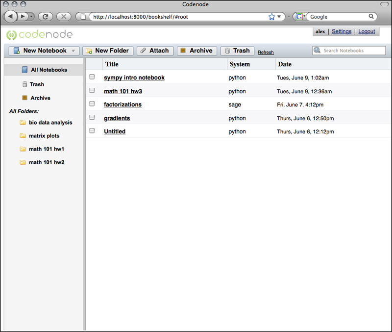

.. _bookshelf:

The Bookshelf
=============

The `Bookshelf` is the management interface to all `Notebooks`, and associated data.

**Screenshot of an example Bookshelf:**

Create a new Notebook
---------------------
Click the 'New Notebook' button to create a new Notebook 
from the listing of all available Notebook types.

Search
------
All Notebook (all Cells in a given Notebook) content is continually being indexed 
to provide searching capabilities of both the code and the text.

Sorting and Viewing
-------------------
All titles in the Notebook listing column are clickable, to perform a sorting action.  
Clicking again performs the same sort, but in reverse.

Folders
-------
Store related notebooks.  Changing title of folders

Archive
-------
Save for later, but not likely used currently.

Deleting Notebooks
-------------------
Move to trash (by drag-n-drop or radio button selection). 
Does not fully remove the Notbeook, you need to empty the Trash for this to occur.

Attach
------
[WORK IN PROGRESS]

Attach data to notebooks, to be used from within a Notebook session. 
Provide the ability to supply a URL on the internet, and codenode 
will try to download the file and associate it with one or more notebooks.
