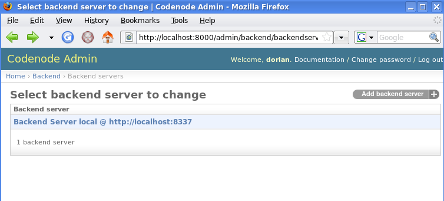
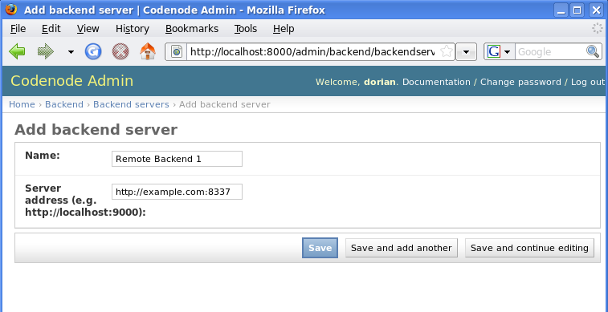

Installing codenode
===================
.. _install:

Fast install 
------------
The quickest way to install in to use `easy_install`::

    $ easy_install codenode

Recommended install  
-------------------
A better way to install `codenode` is to use pip+virtualenv::

    $ virtualenv --no-site-packages mycodenode_env
    $ pip -E mycodenode_env install codenode

With `virtualenv` you can create isolated Python environments, 
and then using pip you can directly install new packages into your `virtualenv`s.
Once you are through using a given `virtualenv`, it is safe to completely remove
it, and because it is self-contained, no traces of packages install will be left on
the system.  Using `virtualenv` is an excellent way to avoid Python package dependency issues.
(you can download `virtualenv` via `easy_install virtualenv` or `pip install virtualenv`)

.. _installdev:

Advanced install
----------------
To try out the latest features in the master repository::

    $ virtualenv --no-site-packages codenode_env
    $ pip -E codenode_env install -e git://github.com/codenode/codenode.git#egg=codenode

To clone a copy for development::

    $ git clone git://github.com/codenode/codenode.git

Deploying With Remote Backend(s)
--------------------------------

If you are deploying Codenode for public use, you should run the *backend* on
a different server than the *frontend* (be well aware of the security risks
associated with running arbitrary python code through the notebook. Letting
someone run code in the notebook is equivalent to giving them a shell
account on your server).

A *backend* server is registered with a *frontend* through the admin
interface of the web application.

When a user adds a notebook, the *engine* type and *backend* server options
are presented in a list in the bookshelf.

Dependencies
------------

- Twisted
- Django
- Simplejson
- Woosh
- Sphinx

