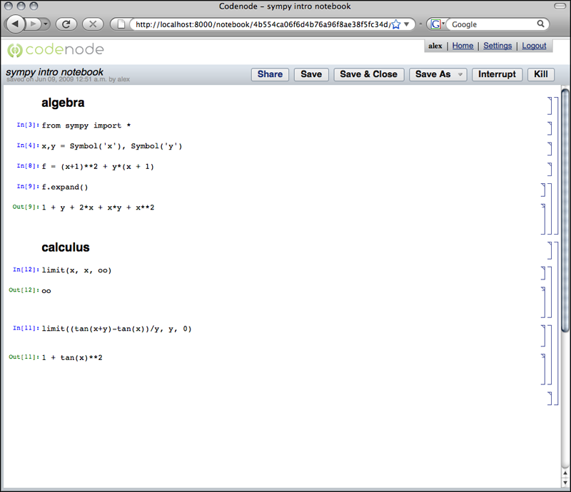

.. _notebook:

The Notebook
============

The Notebook is where you write and run code.

**Screenshot of an example Notebook:**

Notebook Topbar - Buttons and Options
-------------------------------------

**Save**: 
    Save the state of the Notebook.

**Save and Close**: 
    Save and close the notebook window, and return to the Bookshelf.

**Interrupt**: 
    Interrupt/abort the current computation.  Useful for canceling long 
    running computations, infinite loops, etc. Aborts all pending
    evaluation requests as well.  Does **not** effect the running session 
    (namespace, variables, computation results).

**Kill**: 
    Completely stop and clear the Notebook's current running state. 
    **Destroys** namespace, variables.  Does not effect any saved text.
 
**Save As**: 
    [WORK IN PROGRESS] Save the Notebook data to another format such as 
    Source, Text, PDF, ReST, HTML.

**Share**:
    [WORK IN PROGRESS] Share the current Notebook with other Users, so they
    can obtain their own copy of it, or have permissions to edit it.

.. _cells:

Notebook Cells - Functionality and Structure 
--------------------------------------------

A Notebook is comprised of many Cells, which are the text-areas
where you write code or text, or where resulting output appears.

Cell Functionality - How to use Cells effectively
^^^^^^^^^^^^^^^^^^^^^^^^^^^^^^^^^^^^^^^^^^^^^^^^^

**Evaluating code**:
    Pressing the **shift-enter key combination** causes the code in an "Input cell"
    to be sent to the Kernel to be run. The bracket will highlight to
    indicate evaluation is in progress.  The results, if any, are displayed 
    in an "Output Cell" created directly below. 
    The input and an input number will appear to the left of the cell.

**Creating a new cell**:
    Start a new cell by hovering on the empty white area of the Notebook 
    until a **solid black line** appears.  Click and type code or text.

**Change Cell's Type**
    **Right click** on the cell or the cell bracket and select the type    
    from the context menu.

**Delete cells**:
    Selecting a bracket and hit the delete key.
    Opening and closing groups: Double click on a group bracket.  

Cell Components and Types
^^^^^^^^^^^^^^^^^^^^^^^^^

**Cell components**:
    * Left side: Numbers and Labels
    * Center: Code and text input and content area.
    * Right: Brackets indicating context with respect to other cells (grouping/sectioning).

**Output types**:
    * Textual, i.e. the result of a computation.
    * Plot (image)
    * Errors

**Cell types**:
    * Title: Highest level heading cell 
    * Subtitle
    * Section
    * SubSection: Lowest level heading cell
    * Input: (Default, **MOST IMPORTANT**) Write code here.
    * Output: Evaluation results 
    * Text: None evaluable text

Cell Sections and Grouping
^^^^^^^^^^^^^^^^^^^^^^^^^^

Cells can be organized into sections contained by a group cell.

Setting a cell as a heading type causes all the cells of lower section
level below it to be grouped into that section.

Brackets
^^^^^^^^
The solid lines on the far right of all Notebook's Cells. Select a bracket by clicking on it. 
